<!--
  Como usar:
  1. Crie um repositório PÚBLICO com o MESMO nome do seu usuário (ex.: github.com/seuuser/seuuser)
  2. Suba este README.md e os arquivos banner.svg e divisor.svg
  3. Troque SEUUSER, textos e links
-->

<!--
  ARQUIVOS NECESSÁRIOS NO REPOSITÓRIO steznyexe/steznyexe (todos na raiz):
  README.md, banner.svg, divisor.svg, footer.svg, chama-moldura.svg, ceu-vermelho.gif
-->

  

  

## ✦ Sobre mim

Um arquivo pessoal dos meus pensamentos, interesses e criações.
Gosto de **terror psicológico**, **histórias densas** e de **arte**.

- 🕯️ Trabalhando em: **A Casa Da Linha Morta, um jogo de terror psicológico**
- 📖 Estudando: **atualmente me aprofundando em C++**
- 🗝️ Pergunte-me sobre: **A história por trás do jogo, bem como o livro que estou escrevendo**
- 🌹 Fora do código: **escritora...**

  

## ✦ Biblioteca (stack)

  

## ✦ Museu (estatísticas)

 

  

## ✦ A Casa Da Linha Morta

  

<i>O céu sempre foi assim por aqui</i>

Um jogo de terror psicológico em desenvolvimento.
<!-- TODO: 1 ou 2 frases de sinopse, sem spoilers -->
Se quiser conversar sobre a história por trás dele, ou sobre o livro que estou escrevendo, fique à vontade para me chamar.

## ✦ Laboratório (projetos em destaque)

<!-- TODO: troque REPO1 e REPO2 pelos nomes dos seus repositórios -->

## ✦ Livro de visitas (contato)

<!-- TODO: troque SEUUSER (LinkedIn) e seusite.com, ou apague os badges que não for usar -->

 

